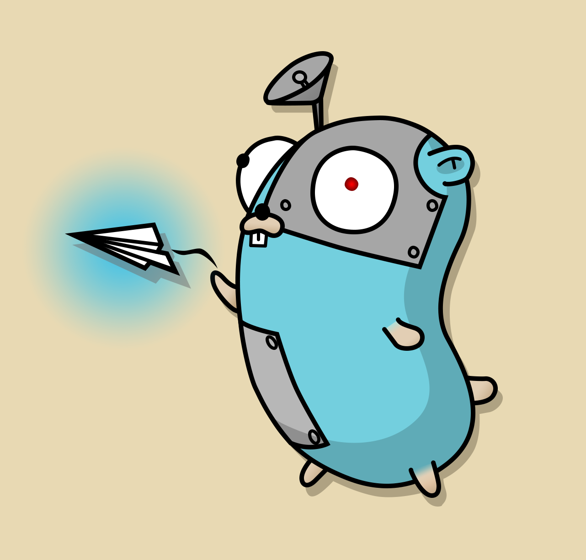

# echotron 

| <br/><br/><br/> [](https://golang.org/) [](https://pkg.go.dev/github.com/NicoNex/echotron/v3) [](https://goreportcard.com/report/github.com/NicoNex/echotron) [](https://github.com/NicoNex/echotron/blob/master/LICENSE) [](https://travis-ci.com/NicoNex/echotron) [](https://coveralls.io/github/NicoNex/echotron?branch=master) [](https://github.com/avelino/awesome-go) [](https://t.me/echotronnews) |
| :------: |

**Echotron** is a concurrent library for telegram bots written in pure Go.

Fetch with

```bash
go get github.com/NicoNex/echotron/v3
```

## Design

**Echotron** is heavily based on concurrency: for example, every call to the `Update` method of each bot is executed on a different goroutine. This makes sure that, even if one instance of the bot is deadlocked, the other ones keep running just fine, making the bot work for other users without any issues and/or slowdowns.

**Echotron** is designed to be as similar to the official [Telegram API](https://core.telegram.org/bots/api) as possible, but there are some things to take into account before starting to work with this library.

- The methods have the exact same name, but with a capital first letter, since in Go methods have to start with a capital letter to be exported.
_Example: `sendMessage` becomes `SendMessage`_
- The order of the parameters in some methods is different than in the official Telegram API, so refer to the [docs](https://pkg.go.dev/github.com/NicoNex/echotron/v3) for the correct one.
- The only `chat_id` (or, in this case, `chatID`) type supported is `int64`, instead of the "Integer or String" requirement of the official API. That's because numeric IDs can't change in any way, which isn't the case with text-based usernames.
- In some methods, you might find a `InputFile` type parameter. [`InputFile`](https://pkg.go.dev/github.com/NicoNex/echotron/v3#InputFile) is a struct with unexported fields, since only three combination of fields are valid, which can be obtained through the methods [`NewInputFileID`](https://pkg.go.dev/github.com/NicoNex/echotron/v3#NewInputFileID), [`NewInputFilePath`](https://pkg.go.dev/github.com/NicoNex/echotron/v3#NewInputFilePath) and [`NewInputFileBytes`](https://pkg.go.dev/github.com/NicoNex/echotron/v3#NewInputFileBytes).
- In some methods, you might find a `MessageIDOptions` type parameter. [`MessageIDOptions`](https://pkg.go.dev/github.com/NicoNex/echotron/v3#MessageIDOptions) is another struct with unexported fields, since only two combination of field are valid, which can be obtained through the methods [`NewMessageID`](https://pkg.go.dev/github.com/NicoNex/echotron/v3#NewMessageID) and [`NewInlineMessageID`](https://pkg.go.dev/github.com/NicoNex/echotron/v3#NewInlineMessageID).
- Optional parameters can be added by passing the correct struct to each method that might request optional parameters. If you don't want to pass any optional parameter, `nil` is more than enough. Refer to the [docs](https://pkg.go.dev/github.com/NicoNex/echotron/v3) to check for each method's optional parameters struct: it's the type of the `opts` parameter.
- Some parameters are hardcoded to avoid putting random stuff which isn't recognized by the Telegram API. Some notable examples are [`ParseMode`](https://github.com/NicoNex/echotron/blob/master/options.go#L21), [`ChatAction`](https://github.com/NicoNex/echotron/blob/master/options.go#L54) and [`InlineQueryType`](https://github.com/NicoNex/echotron/blob/master/inline.go#L27). For a full list of custom hardcoded parameters, refer to the [docs](https://pkg.go.dev/github.com/NicoNex/echotron/v3) for each custom type: by clicking on the type's name, you'll get the source which contains the possible values for that type.

## Usage

### Long Polling

A very simple implementation:

```golang
package main

import (
    "log"

    "github.com/NicoNex/echotron/v3"
)

type bot struct {
    chatID int64
    echotron.API
}

const token = "YOUR TELEGRAM TOKEN"

func newBot(chatID int64) echotron.Bot {
    return &bot{
        chatID,
        echotron.NewAPI(token),
    }
}

func (b *bot) Update(update *echotron.Update) {
    if update.Message.Text == "/start" {
        b.SendMessage("Hello world", b.chatID, nil)
    }
}

func main() {
    dsp := echotron.NewDispatcher(token, newBot)
    log.Println(dsp.Poll())
}
```

Proof of concept with self destruction for low RAM usage:

```golang
package main

import (
    "log"
    "time"

    "github.com/NicoNex/echotron/v3"
)

type bot struct {
    chatID int64
    echotron.API
}

const token = "YOUR TELEGRAM TOKEN"

var dsp echotron.Dispatcher

func newBot(chatID int64) echotron.Bot {
    var bot = &bot{
        chatID,
        echotron.NewAPI(token),
    }
    go bot.selfDestruct(time.After(time.Hour))
    return bot
}

func (b *bot) selfDestruct(timech <- chan time.Time) {
    select {
    case <-timech:
        b.SendMessage("goodbye", b.chatID, nil)
        dsp.DelSession(b.chatID)
    }
}

func (b *bot) Update(update *echotron.Update) {
    if update.Message.Text == "/start" {
        b.SendMessage("Hello world", b.chatId, nil)
    }
}

func main() {
    dsp := echotron.NewDispatcher(token, newBot)
    log.Println(dsp.Poll())
}
```

### Webhook

```golang
package main

import "github.com/NicoNex/echotron/v3"

type bot struct {
	chatID int64
	echotron.API
}

const token = "YOUR TELEGRAM TOKEN"

func newBot(chatID int64) echotron.Bot {
	return &bot{
		chatID,
		echotron.NewAPI(token),
	}
}

func (b *bot) Update(update *echotron.Update) {
	if update.Message.Text == "/start" {
		b.SendMessage("Hello world", b.chatID, nil)
	}
}

func main() {
	dsp := echotron.NewDispatcher(token, newBot)
	dsp.ListenWebhook("https://example.com:443/my_bot_token")
}
```
